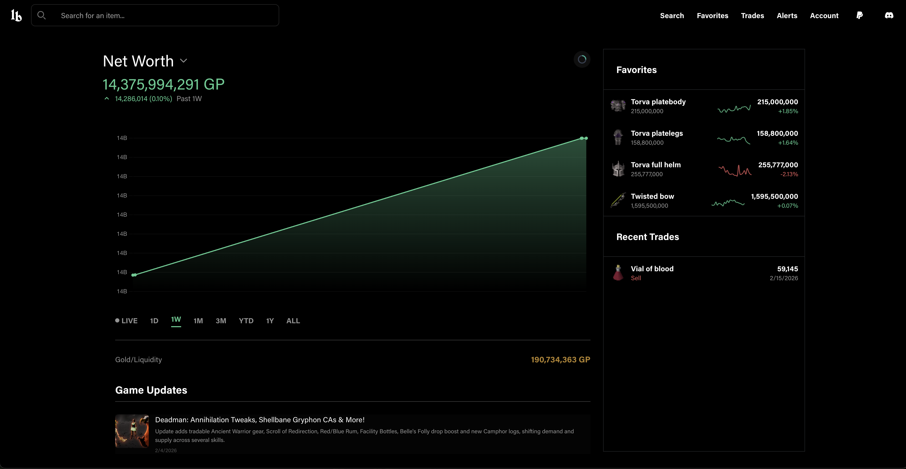
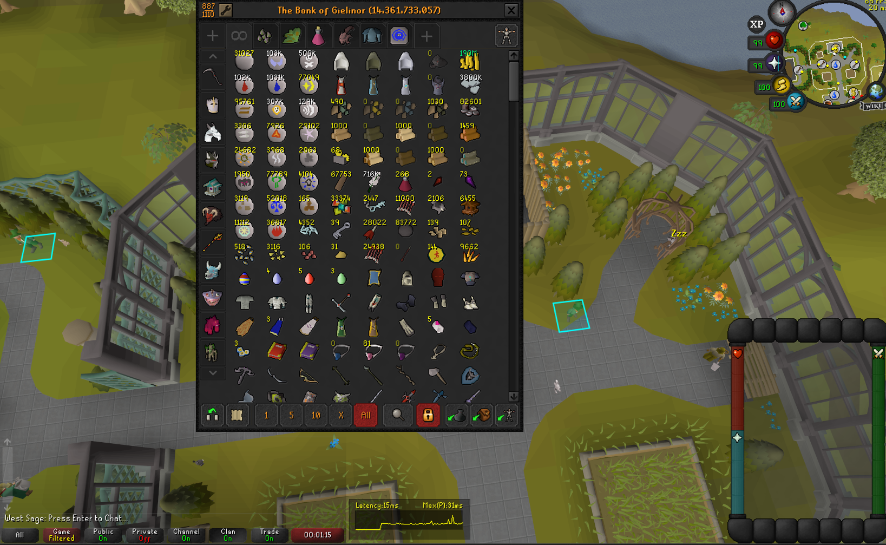
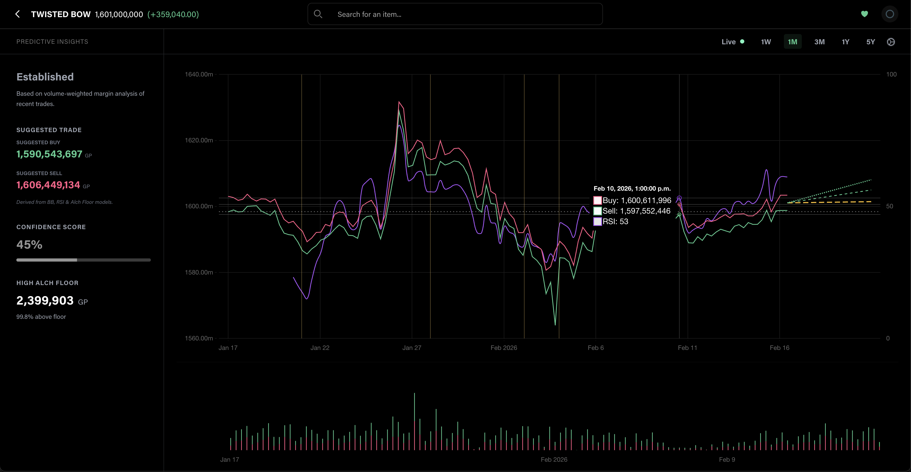
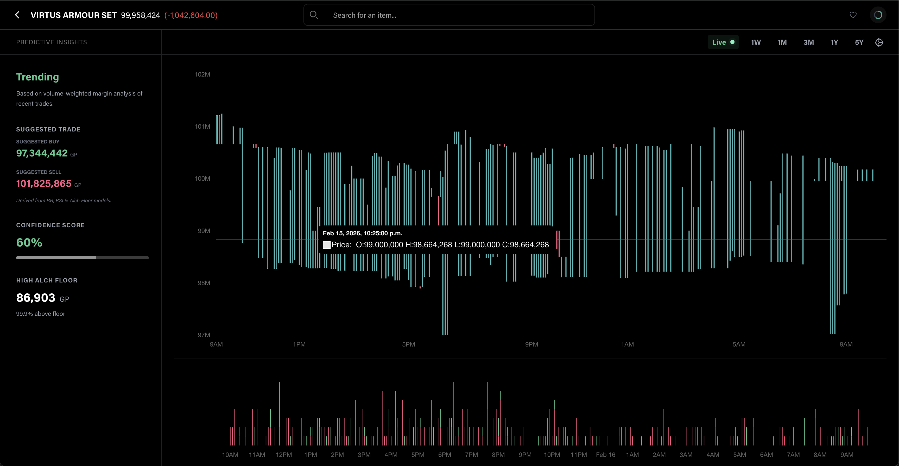
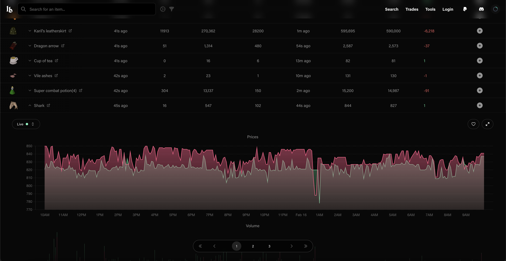
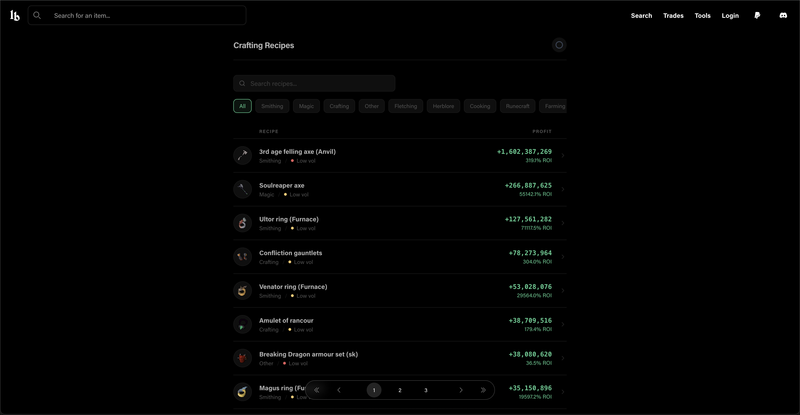
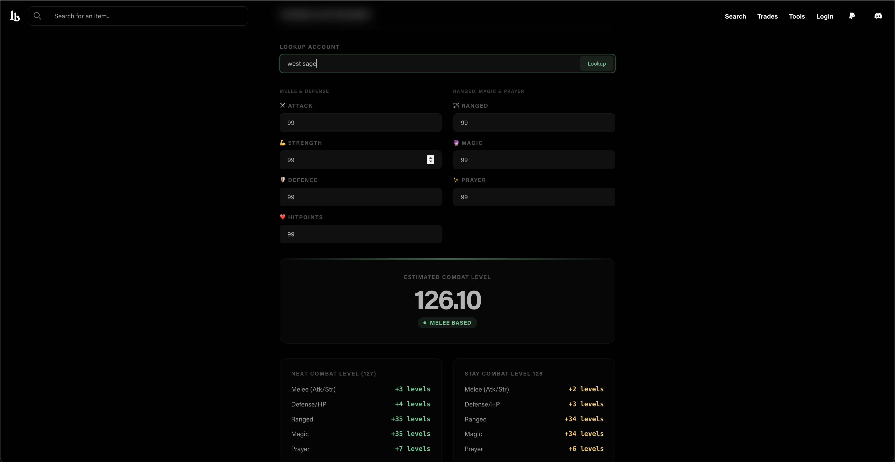

# Lootbag RuneLite Plugin

The Lootbag RuneLite plugin automatically syncs your **Grand Exchange trades** and **Bank items** to the Lootbag servers. This allows you to view advanced analytics, dashboards, and track your wealth and flipping history on the [Lootbag website](https://www.lootbag.gg).

## Features


### Create your portfolio and track your wealth


Data is pushed to your dashboard as you play.

### Predict/Analyze price changes



Automatically syncs your bank value and items securely.

### Advanced Item Search


Search for items and view their price history and Grand Exchange buy and sell offers for detailed profit tracking.

### Utilize helpful tools




## Usage

1. Install the plugin from the RuneLite Plugin Hub.
2. Open the Lootbag side panel in RuneLite.
3. Log in with your Lootbag account (or create one).
4. Your data will start syncing automatically!

## Development Flow/Notes

### Running the plugin

```bash
./gradlew run
```

### Jagex Launcher Support (macOS)

To run the plugin in development mode with a Jagex Launcher account:

1.  Open Terminal.
2.  Configure RuneLite to output credentials (replace path if your RuneLite install differs):
    ```bash
    /Applications/RuneLite.app/Contents/MacOS/RuneLite --configure
    ```
3.  In the "Client arguments" field, add: `--insecure-write-credentials`
4.  Click "Save".
5.  Launch RuneLite via the **Jagex Launcher**. This will write your session tokens to `~/.runelite/credentials.properties`.
6.  Run your development client:
    ```bash
    ./gradlew run
    ```
    The dev client will now automatically pick up the credentials.
